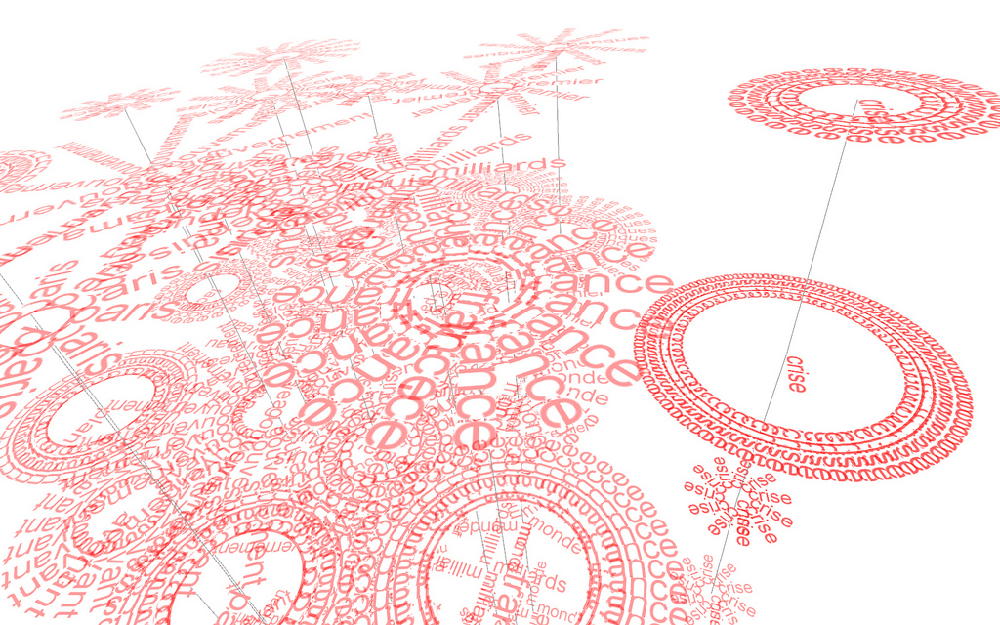

# Similarity Computation using Semantic Networks

[![Build Status][travis_badge]][travis_build]
[![Coverage Status][coveralls_badge]][coveralls_build]
[![Software License][license_badge]][license_link]
[![Documentation Status][rtd_badge]][rtd_link]
[![Stories in Ready][waffle_badge]][waffle_ready]

**A Natural Language Engineering (NLE) implementation of similarity computation using semantic networks (Iosif and Potamianos, 2012).**

[][wordflow_flickr]

## Contributing

This project is an open source implementation of a scientific research paper. Because this is an academic project, we would appreciate it if you would let us know how you intend to use the software (other than simply copying and pasting code so that you can use it in your own projects). If you would like to contribute, you can do so in the following ways:

- Add issues or bugs to the bug tracker: [https://github.com/DistrictDataLabs/semnet-similarity/issues](https://github.com/DistrictDataLabs/semnet-similarity/issues)
- Work on a card on the dev board: [https://waffle.io/DistrictDataLabs/semnet-similarity](https://waffle.io/DistrictDataLabs/semnet-similarity)
- Create a pull request in Github: [https://github.com/DistrictDataLabs/semnet-similarity/pulls](https://github.com/DistrictDataLabs/semnet-similarity/pulls)

If you are a member of the DDL Research Labs Semantic Network Extraction group, you have direct access to the repository, which is set up in a typical production/release/development cycle as described in [A Successful Git Branching Model](http://nvie.com/posts/a-successful-git-branching-model/). A typical workflow is as follows:

1. Select a card from the [dev board](https://waffle.io/DistrictDataLabs/semnet-similarity) - preferably one that is "ready" then move it to "in-progress".

2. Create a branch off of develop called "feature-[feature name]", work and commit into that branch.

        ~$ git checkout -b feature-myfeature develop

3. Once you are done working (and everything is tested) merge your feature into develop.

        ~$ git checkout develop
        ~$ git merge --no-ff feature-myfeature
        ~$ git branch -d feature-myfeature
        ~$ git push origin develop

4. Repeat. Releases will be routinely pushed into master via release branches, then deployed to the server.

## About

This project attempts to implement the unsupervised "similarity computation using semantic networks" methodology as described in [1]. This is part of the District Data Research Labs Spring 2015 group projects on Semantic Network Extraction.

### References

1. E. Iosif and A. Potamianos, “[Similarity computation using semantic networks created from web-harvested data][iosif_2012_paper],” Natural Language Engineering, pp. 1–31, 2012.

2. E. Iosif and A. Potamianos, “[Unsupervised semantic similarity computation between terms using web documents][iosif_2010_paper],” Knowledge and Data Engineering, IEEE Transactions on, vol. 22, no. 11, pp. 1637–1647, 2010.

3. The image used in this README, [News Obsession Word Flow Experiment #1][wordflow_flickr] by [Samuel Huron](https://www.flickr.com/photos/samuel-huron/) is licensed under [CC BY-NC-ND 2.0](https://creativecommons.org/licenses/by-nc-nd/2.0/)

<!-- Link References -->

[wordflow_flickr]: https://flic.kr/p/6XGcBZ
[iosif_2012_paper]: http://journals.cambridge.org/action/displayAbstract?fromPage=online&aid=9479647&fileId=S1351324913000144
[iosif_2010_paper]: http://www.telecom.tuc.gr/~potam/preprints/journal/2009_iosif_potamianos_PREGALLEY.pdf
[waffle_ready]: https://waffle.io/DistrictDataLabs/semnet-similarity
[waffle_badge]: https://badge.waffle.io/DistrictDataLabs/semnet-similarity.png?label=ready&title=Ready
[travis_badge]: https://travis-ci.org/DistrictDataLabs/semnet-similarity.svg?branch=master
[travis_build]: https://travis-ci.org/DistrictDataLabs/semnet-similarity
[coveralls_badge]: https://coveralls.io/repos/DistrictDataLabs/semnet-similarity/badge.svg?branch=develop
[coveralls_build]: https://coveralls.io/r/DistrictDataLabs/semnet-similarity

<!-- Other Badges -->
[license_badge]: https://img.shields.io/github/license/DistrictDataLabs/semnet-similarity.svg
[license_link]: https://github.com/DistrictDataLabs/semnet-similarity/blob/master/LICENSE
[rtd_badge]: https://readthedocs.org/projects/semnet-similarity/badge/?version=latest
[rtd_link]: https://readthedocs.org/projects/semnet-similarity/?badge=latest
